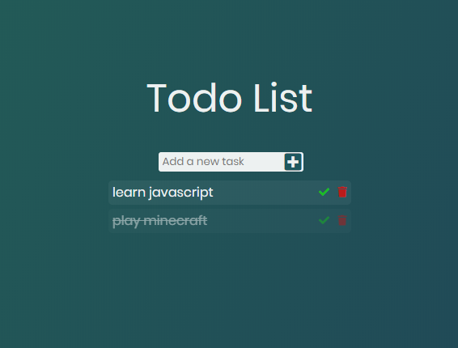

# Todo List
 A simple JavaScript todo list with local storage
 
 Live demo:
 
 https://val8119.github.io/sandbox/todo_list/
 
 Example:
 
 
 
 (I had some trouble with displaying loaded tasks correctly so I watched a tutorial and rewrote the code)
